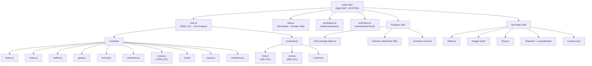
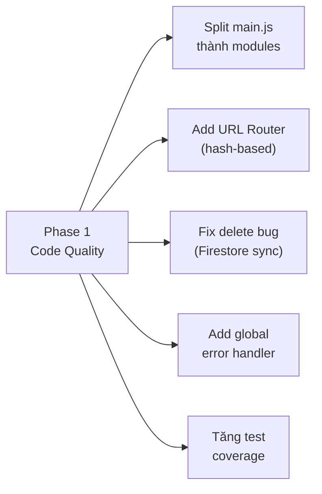
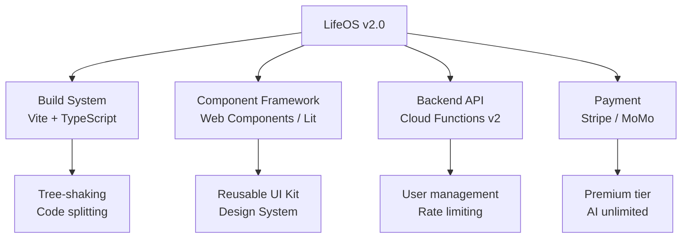

# 📊 BÁO CÁO PHÂN TÍCH & ĐÁNH GIÁ DỰ ÁN LifeOS Online

> **Ngày phân tích**: 03/10/2026  
> **Live Demo**: [lifeos-online-2026-v1.netlify.app](https://lifeos-online-2026-v1.netlify.app)  
> **Tech Stack**: Vanilla JS (ES6+) · Firebase Firestore · Netlify CDN · PWA

---

## 1. TỔNG QUAN DỰ ÁN

LifeOS Online là một **Single Page Application (SPA) quản lý cuộc sống toàn diện**, được xây dựng bằng **Vanilla JavaScript thuần** (không React/Vue/Angular). Ứng dụng tích hợp **14+ tính năng** chính, từ quản lý dự án, tài chính, thói quen, đến trợ lý AI và học từ vựng.

### Quy mô Codebase

| File | Dòng Code | Kích thước |
|------|-----------|------------|
| `main.js` (Core Engine) | **2,581** | 129 KB |
| `style.css` (UI Design) | **2,492** | 102 KB |
| `index.html` (App Shell) | **1,969** | 147 KB |
| `vocab.js` (Từ vựng) | **1,796** | 81 KB |
| `chat.js` (AI Chat) | **769** | 40 KB |
| `notes.js` (Ghi chú) | **723** | 31 KB |
| `tools.js` (AI Tools) | **608** | 30 KB |
| Các module khác | ~1,200 | ~55 KB |
| **TỔNG CỘNG** | **~12,000+** | **~615 KB** |

---

## 2. ĐÁNH GIÁ TỪNG TÍNH NĂNG

### ✅ Các tính năng HOẠT ĐỘNG TỐT

#### 2.1 Hệ thống Authentication & Multi-device Sync
- ✅ Google Sign-In qua Firebase Auth
- ✅ Real-time sync qua Firestore `onSnapshot`
- ✅ Demo Mode cho người dùng thử (LocalStorage)
- ✅ Multi-workspace support

#### 2.2 Quản lý Dự án (Project Pro)
- ✅ **4 chế độ xem**: All Projects Grid / Kanban Board / List View / Gantt Chart
- ✅ Native HTML5 Drag & Drop cho Kanban
- ✅ Sub-tasks với progress bar tự động
- ✅ Shared projects qua Firestore (real-time)
- ✅ Project chat giữa các thành viên
- ✅ Project notes & timeline

#### 2.3 Tài chính cá nhân
- ✅ Thu/chi categories + phương thức thanh toán
- ✅ Chart.js visualization (biểu đồ tròn, biểu đồ cột)
- ✅ Lọc theo tháng, export CSV
- ✅ Quick Finance modal (thêm nhanh)

#### 2.4 Ghi chú thông minh (Notes)
- ✅ Editor.js block-based rich text editor
- ✅ Templates (Meeting, Journal, Project, Table, Excel Sheet)
- ✅ AI Auto-Tagging & AI Continue Writing
- ✅ Backlinks (cross-note references)
- ✅ Export Markdown
- ✅ Note colors & pinning
- ✅ Trash/Restore system
- ✅ Spreadsheet mode (x-data-spreadsheet + SheetJS)

#### 2.5 Trợ lý AI (Gemini Integration)
- ✅ Multi-turn conversation với function calling
- ✅ **10+ AI tools** (navigate, todo, finance, pomodoro, theme, stats, habit, note, vocab...)
- ✅ Voice Input (Web Speech API)
- ✅ Local heuristic fallback khi offline
- ✅ Model auto-fallback (2.0 Flash → 1.5 Flash → 1.5 Flash-8B)
- ✅ AI Weekly Digest

#### 2.6 Các module khác
- ✅ **Pomodoro Timer**: Circular progress ring, sound alerts, stats tracking
- ✅ **Habits**: Streak tracking, GitHub-style heatmap
- ✅ **Goals**: Progress bars, deadline tracking
- ✅ **Journal**: Mood picker, date-based entries
- ✅ **Vocabulary**: Flashcards, PDF/Word import, AI extraction, community sharing, quiz/test mode, spaced repetition
- ✅ **Calendar**: Month view + Week schedule view, recurring events
- ✅ **Today View**: Aggregated dashboard (todos, habits, events, pomodoro)
- ✅ **Command Palette**: Ctrl+K quick navigation
- ✅ **PWA**: Service Worker, manifest.json, offline support

---

### ⚠️ CÁC THIẾU SÓT & VẤN ĐỀ PHÁT HIỆN

#### 🔴 Nghiêm trọng (Critical)

| # | Vấn đề | Chi tiết | File |
|---|--------|----------|------|
| 1 | **Firebase API Key lộ trong source code** | `apiKey`, `projectId`, `appId` được hardcode trực tiếp trong `index.html` (dòng 43-51). Dù đây là Firebase client key (bình thường cho web), nhưng **không có domain restriction** ở Firebase Console sẽ tạo rủi ro abuse. | `index.html:43-51` |
| 2 | **Nút "Xóa tất cả" không persist** | Dòng 2048: `window.DB={}` chỉ xóa in-memory, **KHÔNG xóa trên Firestore**, nên data sẽ quay lại khi reload. | `index.html:2048` |
| 3 | **XSS tiềm ẩn** | `formatMarkdown()` trong `chat.js` dùng `innerHTML` để render markdown AI response. Dù có escape HTML cơ bản, nhưng chuỗi dạng `\`...\`` chứa HTML vẫn có thể inject. | `chat.js:12-38` |
| 4 | **index.html monolithic** | File HTML **2,093 dòng / 147KB** chứa toàn bộ modals, pages, layout. Không có template system hay component splitting. | `index.html` |

#### 🟡 Quan trọng (Important)

| # | Vấn đề | Chi tiết |
|---|--------|----------|
| 5 | **`main.js` quá lớn** | 2,581 dòng trong một file duy nhất. Chứa routing, rendering, event handling, calendar logic, finance logic, schedule, overview... Khó maintain và debug. |
| 6 | **Không có router thực sự** | Sử dụng `nav()` function thay đổi CSS class `active` trên các `.page` div. **Không có URL-based routing** (hash routing hoặc History API), nên không thể deep link hay back/forward navigation. |
| 7 | **Không có build pipeline** | Không dùng bundler (Webpack/Vite/esbuild). Tất cả JS modules load riêng lẻ qua `<script>` tags, gây nhiều HTTP requests. |
| 8 | **Không có TypeScript** | Toàn bộ vanilla JS không có type checking. Dễ gây runtime errors do typos hoặc wrong types. |
| 9 | **Thiếu Error Boundary** | Lỗi ở bất kỳ module nào có thể crash toàn bộ ứng dụng. Không có global error handler. |
| 10 | **Service Worker quá đơn giản** | Cache strategy là network-first, chỉ cache 5 files app shell. Không cache fonts, CDN libraries, images. Offline experience rất hạn chế. |

#### 🟠 Cải thiện được (Improvements)

| # | Vấn đề | Chi tiết |
|---|--------|----------|
| 11 | **Accessibility (A11y) yếu** | Không có `aria-label` cho phần lớn buttons, không có focus management cho modals, không có skip navigation, nhiều inline `onclick` thay vì addEventListener. |
| 12 | **Không có unit test đáng kể** | Chỉ có 1 file test (`data.test.js`, 28 dòng) test module `data.js`. Không test logic quan trọng (finance calc, calendar, routing). |
| 13 | **Inline styles rất nhiều** | Hàng trăm inline `style="..."` trong HTML, khó maintain và override. |
| 14 | **Global scope pollution** | Hầu hết functions được gắn vào `window.*`, biến toàn cục nhiều: `window.DB`, `window.currentUser`, `window.renderAll`... |
| 15 | **Thiếu i18n infrastructure** | Tất cả text hardcode tiếng Việt. Không có system để thay đổi ngôn ngữ. |
| 16 | **Mobile UX có thể cải thiện** | Kanban drag & drop chưa hoạt động tốt trên touch devices. Bottom sheet navigation tốt nhưng gesture swipe chưa có. |

---

## 3. KIẾN TRÚC HỆ THỐNG

---

## 4. ĐIỂM MẠNH NỔI BẬT

| Điểm mạnh | Giải thích |
|------------|------------|
| 🚀 **Zero-framework, siêu nhẹ** | Bundle <250KB (không framework overhead), load <100ms. Đây là selling point mạnh cho portfolio. |
| 🎨 **UI/UX chất lượng cao** | Glassmorphism design, dark/light theme, responsive, animations smooth. Chuyên nghiệp ngang Notion. |
| 🤖 **AI Integration sâu** | Function calling loop, voice input, auto-fallback models, context-aware system prompt. Không phải demo toy. |
| 🔄 **Real-time Sync** | Firestore `onSnapshot` cho instant sync cross-device. Shared projects có chat real-time. |
| 📱 **PWA ready** | Service Worker, manifest, installable, mobile bottom nav, offline fallback. |
| 📊 **Feature-rich** | 14+ modules hoàn chỉnh, mỗi module có depth (vocab có cả community sharing, PDF import, quiz). |
| 🔐 **Firestore Security Rules tốt** | Owner/member-based access control, proper validation trên shared_projects, shared_tasks, shared_vocab_decks. |

---

## 5. HƯỚNG PHÁT TRIỂN ĐỀ XUẤT

### 🔵 Phase 1: Ổn định & Code Quality (1-2 tuần)

| Task | Ưu tiên | Effort | Impact |
|------|---------|--------|--------|
| Tách `main.js` thành 8-10 modules (calendar.js, finance.js, overview.js...) | 🔴 Cao | 2-3 ngày | Maintainability tăng 5x |
| Thêm Hash Router (`#/calendar`, `#/projects/p1`) | 🔴 Cao | 1 ngày | Deep linking, browser back/forward |
| Fix nút "Xóa dữ liệu" (sync Firestore) | 🔴 Cao | 2 giờ | Data integrity |
| Global error boundary + toast fallback | 🟡 Trung bình | 4 giờ | UX stability |
| Viết unit tests cho finance, calendar, data modules | 🟡 Trung bình | 2 ngày | Regression prevention |
| Sanitize AI response HTML (DOMPurify) | 🔴 Cao | 2 giờ | Security |

### 🟢 Phase 2: UX & Performance (2-4 tuần)

| Task | Mô tả |
|------|-------|
| **Touch Drag & Drop** | Thêm touch events cho Kanban mobile (hoặc dùng SortableJS) |
| **Lazy Loading** | Dynamic `import()` cho các module lớn (vocab, notes, ai) khi navigate đến |
| **IndexedDB adapter** | Thay LocalStorage (5MB limit) bằng IndexedDB cho offline data lớn hơn |
| **Accessibility audit** | ARIA labels, focus trap modals, keyboard navigation, screen reader support |
| **Notification system** | Push notifications cho sự kiện, deadline, pomodoro end (Notification API) |
| **Search engine** | Full-text search across notes, todos, projects, vocab (Fuse.js hoặc FlexSearch) |

### 🟣 Phase 3: Tính năng mới (1-3 tháng)

| Tính năng | Giá trị | Effort |
|-----------|---------|--------|
| **📅 Calendar Sync** (Google Calendar API) | Import/export sự kiện 2 chiều | Cao |
| **📊 Advanced Analytics** | Biểu đồ trend thu chi, habit streak analysis, productivity score | Trung bình |
| **🌐 Internationalization (i18n)** | Hỗ trợ English, Vietnamese, có thể thêm ngôn ngữ | Trung bình |
| **📱 Native Mobile App** | Capacitor.js hoặc TWA (Trusted Web Activity) để publish lên App Store/Play Store | Cao |
| **🔗 API Integration Hub** | Notion import, Trello import, Google Tasks sync | Cao |
| **👥 Team Workspace** | Role-based access (Admin/Editor/Viewer), team dashboard | Rất cao |
| **📧 Email Reminders** | Firebase Cloud Functions gửi email nhắc nhở deadline | Trung bình |
| **🧠 AI Agent Mode** | AI tự động lên kế hoạch tuần, suggest todo priority, detect spending patterns | Cao |

### 🔶 Phase 4: Enterprise & Scale (3-6 tháng)

---

## 6. KẾT LUẬN

### Điểm đánh giá tổng thể

| Tiêu chí | Điểm (1-10) | Ghi chú |
|----------|-------------|---------|
| **Tính năng (Feature)** | 🌟 **9/10** | Rất đầy đủ, depth tốt mỗi module |
| **UI/UX Design** | 🌟 **8.5/10** | Glassmorphism đẹp, responsive tốt |
| **Code Quality** | ⚡ **6/10** | Monolithic, thiếu types, global vars nhiều |
| **Performance** | 🌟 **8/10** | Load nhanh nhờ zero-framework, nhưng thiếu code splitting |
| **Security** | ⚡ **6.5/10** | Firestore rules tốt, nhưng XSS risk và key exposure |
| **Testing** | ⚠️ **3/10** | Gần như không có test coverage |
| **Maintainability** | ⚡ **5/10** | main.js monolithic, inline styles, global scope |
| **PWA/Mobile** | 🌟 **7.5/10** | Có SW + manifest nhưng offline experience hạn chế |

> [!IMPORTANT]
> **Tổng quan**: LifeOS Online là một dự án **portfolio xuất sắc** với feature set ấn tượng và UI chuyên nghiệp. Điểm mạnh lớn nhất là **zero-framework approach** chứng minh kỹ năng vanilla JS sâu. Để phát triển thành sản phẩm thực sự, cần tập trung vào **code splitting, testing, và security hardening** ở Phase 1-2.

> [!TIP]
> **Khuyến nghị ưu tiên hàng đầu**: 
> 1. Tách `main.js` → tăng maintainability
> 2. Thêm Hash Router → UX chuyên nghiệp hơn
> 3. Thêm DOMPurify → bảo mật AI responses
> 4. Viết test cho finance/calendar logic → regression prevention
