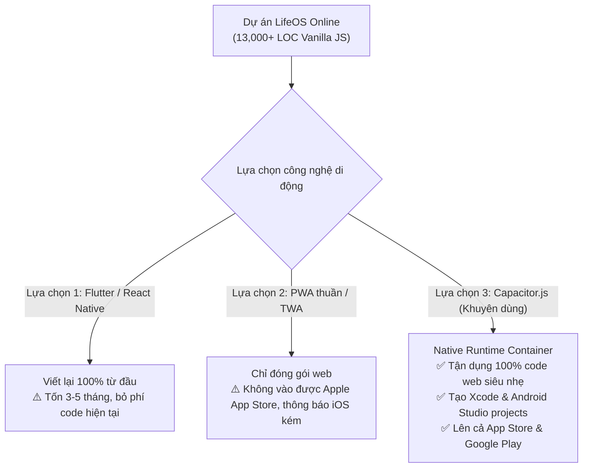
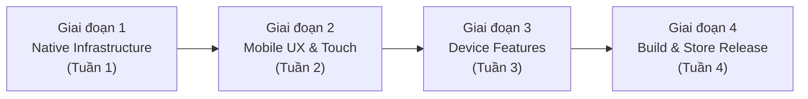

# 📱 Kế hoạch Chuyển đổi LifeOS Online thành Ứng dụng Di Động Toàn Diện (iOS & Android)

> **Mục tiêu**: Chuyển đổi Single Page Application (Vanilla JS) thành ứng dụng di động native thực thụ chạy mượt mà trên cả **iOS (iPhone/iPad)** và **Android**, tối ưu hóa 100% trải nghiệm chạm/vuốt (Touch UX) và tích hợp các tính năng phần cứng của điện thoại.

---

## 1. Lựa chọn Công nghệ & Kiến trúc Nền tảng

### Phân tích giải pháp kỹ thuật



### Tại sao chọn Capacitor.js (v6/v7)?
1. **Bảo toàn 100% code hiện có**: Không phải viết lại 13,000 dòng Vanilla JS; giữ trọn tốc độ tải trang tức thì (<100ms, zero-overhead).
2. **Native iOS & Android**: Xuất ra thư mục native chuẩn (`android/` cho Android Studio và `ios/` cho Xcode).
3. **Native Plugins phong phú**: Truy cập trực tiếp Haptic engine (rung phản hồi), Local Notifications (thông báo khi app tắt), Biometric (FaceID/Vân tay), Camera, FileSystem.
4. **Offline First**: Đóng gói toàn bộ code HTML/CSS/JS cục bộ trong app bundle, khởi động offline 100% không cần kết nối mạng.

---

## 2. Lộ trình Triển khai 4 Giai đoạn



---

## GIAI ĐOẠN 1: Thiết lập Hạ tầng Native (Capacitor Engine)

### 1.1 Khởi tạo môi trường Capacitor
Cài đặt Capacitor Core, CLI và 2 nền tảng:
```bash
npm install @capacitor/core @capacitor/cli
npx cap init "LifeOS" "com.nhan.lifeos" --web-dir "."
npm install @capacitor/android @capacitor/ios
npx cap add android
npx cap add ios
```

### 1.2 Cài đặt bộ Native Plugins thiết yếu
```bash
npm install @capacitor/app @capacitor/haptics @capacitor/keyboard @capacitor/status-bar @capacitor/splash-screen @capacitor/local-notifications @capacitor/network @capacitor/preferences
```

### 1.3 Cấu hình `capacitor.config.json`
```json
{
  "appId": "com.nhan.lifeos",
  "appName": "LifeOS",
  "webDir": ".",
  "bundledWebRuntime": false,
  "plugins": {
    "SplashScreen": {
      "launchShowDuration": 2000,
      "backgroundColor": "#07070f",
      "showSpinner": false,
      "androidScaleType": "CENTER_CROP"
    },
    "StatusBar": {
      "style": "DARK",
      "backgroundColor": "#07070f"
    },
    "Keyboard": {
      "resize": "body",
      "style": "DARK",
      "resizeOnFullScreen": true
    }
  },
  "server": {
    "androidScheme": "https"
  }
}
```

### 1.4 Thiết lập kịch bản Build & Sync trong `package.json`
```json
"scripts": {
  "test": "node --test test/*.test.js",
  "check": "node --check js/data.js && node --check js/main.js ...",
  "cap:sync": "npx cap sync",
  "cap:android": "npx cap sync android && npx cap open android",
  "cap:ios": "npx cap sync ios && npx cap open ios"
}
```

---

## GIAI ĐOẠN 2: Tối ưu Hóa Trải nghiệm Di động (Mobile UX Revolution)

### 2.1 Xử lý Notch, Dynamic Island & Safe Area Insets
Trên iPhone có Tai thỏ / Dynamic Island và Android có thanh điều hướng cử chỉ, giao diện phải co giãn đúng chuẩn `viewport-fit=cover`:
- **CSS Safe Areas**:
  ```css
  :root {
    --sat: env(safe-area-inset-top, 0px);
    --sab: env(safe-area-inset-bottom, 0px);
    --sal: env(safe-area-inset-left, 0px);
    --sar: env(safe-area-inset-right, 0px);
  }

  .topbar {
    padding-top: calc(var(--sat) + 8px) !important;
    height: calc(56px + var(--sat)) !important;
  }

  .mobile-nav {
    padding-bottom: var(--sab) !important;
    height: calc(var(--mobile-nav-h) + var(--sab)) !important;
  }
  ```

### 2.2 Chuyển đổi Modals thành Bottom Sheets (Vuốt xuống để đóng)
Trên desktop, modal nằm giữa màn hình. Trên di động, modal cần mở từ đáy màn hình lên (**Native Bottom Sheet**) với tay nắm kéo (grabber bar):
- Thêm tay nắm `.sheet-handle` ở đỉnh modal trên mobile.
- Hỗ trợ cử chỉ vuốt kéo xuống (`touchmove`, `touchend`) để đóng modal mượt mà.
- Hiệu ứng `translateY(100%)` trượt lên với cubic-bezier chuẩn iOS.

### 2.3 Giải quyết triệt để Kéo thả (Touch Drag & Drop) cho Kanban
- **Vấn đề**: API HTML5 Drag & Drop mặc định không chạy hoặc chập chờn trên màn hình cảm ứng di động.
- **Giải pháp**: Tích hợp module touch gestures nhẹ (~8KB) hoặc `SortableJS` cho:
  - Bảng Kanban Dự án (4 cột: Khởi tạo, Cần làm, Đang làm, Hoàn thành).
  - Bảng Kanban Todo theo độ ưu tiên.
  - Tự động rung nhẹ (Haptic pulse) khi nhấc thẻ và khi thả vào cột mới.

### 2.4 Xử lý Bàn phím Ảo (Virtual Keyboard Handling)
- Khi bàn phím bật lên trên điện thoại, input thường bị che khuất.
- Sử dụng `@capacitor/keyboard`:
  - Lắng nghe sự kiện `keyboardWillShow` để ẩn tạm thời Bottom Navigation Bar.
  - Tự động cuộn ô input đang focus vào giữa khung nhìn (`scrollIntoView({ behavior: 'smooth', block: 'center' })`).
  - Lắng nghe `keyboardWillHide` để phục hồi lại Bottom Bar.

### 2.5 Nút Back cứng trên Android (Hardware Back Button)
- Khi người dùng bấm nút Back hoặc vuốt cạnh mép trên Android:
  1. Nếu có Modal/Sheet đang mở → Đóng modal.
  2. Nếu Drawer/Sidebar đang mở → Đóng drawer.
  3. Nếu đang ở trang phụ (ví dụ: `#calendar`) → Quay về trang `#today`.
  4. Nếu đang ở `#today` → Hiển thị toast: *"Nhấn lần nữa để thoát ứng dụng"*, nhấn lần 2 trong 2s mới thoát (`App.exitApp()`).

---

## GIAI ĐOẠN 3: Tích hợp Tính năng Phần cứng & Offline Sâu

### 3.1 Phản hồi xúc giác (Haptic Feedback System)
Tạo tệp điều khiển rung `js/modules/mobile/haptics.js`:
```javascript
import { Haptics, ImpactStyle, NotificationType } from '@capacitor/haptics';

export const MobileHaptic = {
  tap: () => Haptics.impact({ style: ImpactStyle.Light }),
  success: () => Haptics.notification({ type: NotificationType.Success }),
  warning: () => Haptics.notification({ type: NotificationType.Warning }),
  selection: () => Haptics.selectionChanged()
};
```
- Tích hợp vào: Check hoàn thành Todo, bấm Pomodoro Start/Stop, check-in thói quen, lật thẻ từ vựng Flashcard.

### 3.2 Lập lịch Thông báo Nội bộ (Local Notifications Alarms)
- Không phụ thuộc vào kết nối mạng hay Service Worker.
- Lập lịch thông báo chính xác từng giây qua `@capacitor/local-notifications`:
  - **Pomodoro Timer**: Thông báo ngay cả khi màn hình khóa hoặc chuyển sang app khác.
  - **Nhắc việc hôm nay**: Tự động đặt lịch 8:00 sáng mỗi ngày liệt kê các việc cần làm.
  - **Hạn chót công việc**: Báo trước 30 phút hoặc 1 ngày trước deadline.

### 3.3 Khóa Ứng dụng bằng Sinh trắc học (FaceID / Vân tay)
- Bảo vệ dữ liệu nhạy cảm (module Thu Chi & Nhật ký cá nhân).
- Plugin: `@epicshane/capacitor-biometric-auth` hoặc `@capacitor-community/privacy-screen` (tự động làm mờ app switcher khi chuyển ứng dụng).

### 3.4 Thay thế LocalStorage bằng IndexedDB / SQLite Storage
- `localStorage` bị giới hạn 5MB trên mobile WebViews, dễ bị tràn khi người dùng lưu nhiều ghi chú hoặc tài liệu từ vựng PDF.
- Tích hợp lớp chuyển tiếp `idb-keyval` (chỉ 1KB) để lưu trữ không giới hạn dung lượng trên máy di động.

---

## GIAI ĐOẠN 4: Đóng gói, Tối ưu & Xuất bản App Store / Google Play

### 4.1 Thiết kế Bộ Nhận diện (Icons & Splash Screens)
- Sử dụng `@capacitor/assets`:
  - Chỉ cần 1 file `assets/icon.png` (1024x1024) và `assets/splash.png` (2732x2732).
  - Tự động sinh ra đầy đủ bộ Adaptive Icons cho mọi mật độ điểm ảnh Android (mdpi, hdpi, xhdpi, xxhdpi, xxxhdpi) và toàn bộ icon sets cho iOS/iPadOS.

### 4.2 Cấu hình Dự án Android Studio
- **Package Name**: `com.nhan.lifeos`
- **Target SDK**: Android 14 / 15 (API level 34+)
- **Build Types**: Kích hoạt Minify & ProGuard/R8 để tối ưu dung lượng APK dưới 5MB.
- **Ký số**: Tạo khóa Keystore `lifeos-release-key.jks` để xuất file `.aab` (Android App Bundle) tải lên Google Play Console.

### 4.3 Cấu hình Dự án Xcode (iOS)
- **Bundle Identifier**: `com.nhan.lifeos`
- **Signing & Capabilities**: Kết nối Apple Developer Program, tự động quản lý provisioning profile.
- **Privacy Manifest (`PrivacyInfo.xcprivacy`)**: Khai báo quyền riêng tư bắt buộc theo quy định mới nhất của Apple (quyền thông báo, lưu trữ file).
- Xuất bản qua Xcode Organizer lên TestFlight để thử nghiệm trước khi submit App Store.

---

## 3. Bảng Phân công & Ước lượng Thời gian

| Hạng mục | Công việc chi tiết | Độ ưu tiên | Thời gian |
|---|---|---|---|
| **M1: Core Capacitor Setup** | Cài đặt CLI, sinh thư mục `android/`, `ios/`, cấu hình status bar, splash screen | 🔴 Cao | 2 ngày |
| **M2: Safe Area & Viewport** | Sửa CSS toàn bộ topbar, bottom nav, modals theo biến `env(safe-area-inset-*)` | 🔴 Cao | 1.5 ngày |
| **M3: Touch Drag & Drop** | Thay HTML5 drag bằng Touch events cho Kanban & Task lists | 🔴 Cao | 2 ngày |
| **M4: Mobile Bottom Sheets** | Viết CSS & Gesture trượt kéo mở/đóng modal theo phong cách native sheet | 🟡 Trung bình | 2 ngày |
| **M5: Native Hardware Actions** | Xử lý Android Back button, ẩn bottom bar khi mở bàn phím ảo | 🔴 Cao | 1.5 ngày |
| **M6: Haptics & Notifications** | Tích hợp rung phản hồi & lập lịch chuông báo Pomodoro / Todo | 🟡 Trung bình | 2 ngày |
| **M7: Storage Upgrade** | Chuyển adapter lưu trữ sang IndexedDB để không bị giới hạn 5MB | 🟡 Trung bình | 1.5 ngày |
| **M8: Store Assets & Signing** | Tạo splash screen, icon bundle, cấu hình Keystore Android & Xcode Profiles | 🟢 Bình thường | 2 ngày |

---

## 4. Kế hoạch Kiểm tra & Thẩm định (Verification Plan)

### Kiểm thử Tự động (Automated Tests)
- Chạy toàn bộ test suites hiện tại: `npm test` và `npm run check`.
- Thêm kiểm thử cho adapter lưu trữ IndexedDB và logic điều hướng native back button.

### Kiểm thử Thực tế trên Thiết bị (Manual Verification Matrix)
1. **Android Emulator & Thiết bị thật (Samsung/Xiaomi/Pixel)**:
   - Kiểm tra hiển thị camera punch-hole và thanh cử chỉ vuốt dưới đáy.
   - Thử nghiệm kéo thả Kanban bằng ngón tay.
   - Bấm nút Back cứng để xác nhận modal đóng đúng thứ tự.
   - Tắt màn hình khi đang bật Pomodoro và kiểm tra chuông báo thức.
2. **iOS Simulator & iPhone thật (TestFlight)**:
   - Kiểm tra Dynamic Island / Tai thỏ trên iPhone 14/15/16 Pro.
   - Kiểm tra rung Taptic Engine khi hoàn thành tác vụ.
   - Kiểm tra bàn phím ảo không đẩy vỡ bố cục ứng dụng.
   - Đóng mạng hoàn toàn (Chế độ máy bay) để kiểm tra khả năng hoạt động offline 100%.
